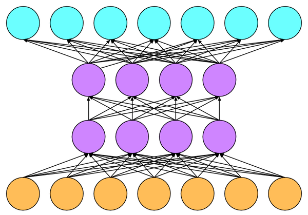
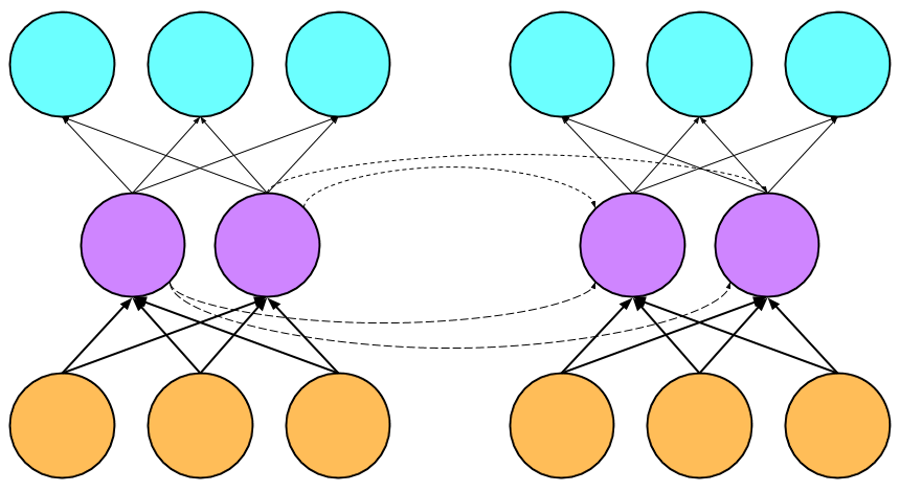

#  Recurrent Neural Networks (RNNs) for Language Modeling

In previous tutorials, we worked with *feedforward* neural networks. They're
called feedforward networks because each layer feeds into the next layer in a
chain connecting the inputs to the outputs.




At each iteration $t$, we feed in a new example $x_t$, by setting the values of
the input nodes (orange). We then *feed the activation forward* by successively
calculating the activations of each higher layer in the network. Finally, we
read the outputs from the topmost layer.

So when we feed the next example $x_{t+1}$, we overwrite all of the previous
activations. If consecutive inputs to our network have no special relationship
to each other (say, images uploaded by unrelated users), then this is perfectly
acceptable behavior. But what if our inputs exhibit a seqeuntial relationship?

Say for example that you want to predict the next character in a string of text.
We might devide to feed each character into the neural network with the goal of
predicting the succeeding character.


In the above example, the neural network forgets the previous context every time
you feed a new input. How is the neural network supposed to know that "e" is
followed by a space? It's hard to see why that should be so probable if you
didn't know that the "e" was the final letter in the word "Time".

Recurrent neural networks provide a slick way to incorporate sequential
structure. At each time step $t$, each hidden layer $h_t$ (typically) will
receive input from both the current input $x_t$ and from *that same hidden
layer* at the previous time step $h_{t-1}$


Now, when our net is trying to predict what comes after the "e" in time, it has
access to its previous *beliefs*, and by extension, the entire history of
inputs. Zooming back in to see how the nodes in a basic RNN are connected,
you'll see that each node in the hidden layer is connected to each node at the
hidden layer at the next time step:



Even though the neural network contains loops (the hidden layer is connected to
itself), because this connection spans a time step our network is still
technically a feedforward network. Thus we can still train by backpropagration
just as we normally would with an MLP. Typically the loss function will be an
average of the losses at each time step.

In this tutorial, we're going to roll up our sleeves and write a simple RNN in
MXNet using nothing but ``mxnet.ndarray`` and ``mxnet.autograd``. In practice,
unless you're trying to develop fundamentlally new recurrent layers, you'll want
to use the prebuilt layers that call down to extremely optimized primitives.
You'll also want to rely some pre-built batching code because batching sequences
can be a pain. But we think in general, if you're going to work with this stuff,
and have a modicum of self respect, you'll want to implement from scratch and
understand how it works at a reasonably low level.

Let's go ahead and import our dependencies and specify our context. If you've
been following along without a GPU until now, this might be where you'll want to
get your hands on some faster hardware. GPU instances are available by the hour
through Amazon Web Services. A single GPU via a [p2
instance](https://aws.amazon.com/ec2/instance-types/p2/) (NVIDIA K80s) or even
an older g2 instance will be perfetly adequate for this tutorial.

```{.python .input  n=1}
from __future__ import print_function
import mxnet as mx
from mxnet import nd, autograd
import numpy as np
mx.random.seed(1)
ctx = mx.gpu(0)
```

## Dataset: "The Time Machine"

Now mess with some data. I grabbed a copy of the ``Time Machine``, mostly
because it's available freely thanks to the good people at [Project
Gutenberg](http://www.gutenberg.org) and a lot of people are tired of seeing
RNNs generate Shakespeare. In case you prefer to torturing Shakespeare to
torturing H.G. Wells, I've also included Andrej Karpathy's tinyshakespeare.txt
in the data folder. Let's get started by reading in the data.

```{.python .input  n=2}
with open("data/nlp/timemachine.txt") as f:
    time_machine = f.read()
```

And you'll probably want to get a taste for what the text looks like.

```{.python .input  n=3}
print(time_machine[0:500])
```

```{.json .output n=3}
[
 {
  "name": "stdout",
  "output_type": "stream",
  "text": "Project Gutenberg's The Time Machine, by H. G. (Herbert George) Wells\n\nThis eBook is for the use of anyone anywhere at no cost and with\nalmost no restrictions whatsoever.  You may copy it, give it away or\nre-use it under the terms of the Project Gutenberg License included\nwith this eBook or online at www.gutenberg.net\n\n\nTitle: The Time Machine\n\nAuthor: H. G. (Herbert George) Wells\n\nRelease Date: October 2, 2004 [EBook #35]\n[Last updated: October 3, 2014]\n\nLanguage: English\n\n\n*** START OF THIS PR\n"
 }
]
```

## Tidying up

I went through and discovered that the last 38083 characters consist entirely of
legalese from the Gutenberg gang. So let's chop that off lest our language model
learn to generate such boring drivel.

```{.python .input  n=4}
print(time_machine[-38075:-37500])
time_machine = time_machine[:-38083]
```

```{.json .output n=4}
[
 {
  "name": "stdout",
  "output_type": "stream",
  "text": "End of Project Gutenberg's The Time Machine, by H. G. (Herbert George) Wells\n\n*** END OF THIS PROJECT GUTENBERG EBOOK THE TIME MACHINE ***\n\n***** This file should be named 35.txt or 35.zip *****\nThis and all associated files of various formats will be found in:\n        http://www.gutenberg.net/3/35/\n\n\n\n        Updated editions will replace the previous one--the old editions\n        will be renamed.\n\n        Creating the works from public domain print editions means that no\n        one owns a United States copyright in these works, so the Foundation\n        (and you!) c\n"
 }
]
```

## Numerical representations of characters

When we create numerical representations of characters, we'll use one-hot
representations. A one-hot is a vector that taked value 1 in the index
corresponding to a character, and 0 elsewhere. Because this vector is as long as
the vocab, let's get a definitive list of characters in this dataset so that our
representation is not longer than necessary.

```{.python .input  n=5}
character_list = list(set(time_machine))
vocab_size = len(character_list)
print(character_list)
print("Length of vocab: %s" % vocab_size)
```

```{.json .output n=5}
[
 {
  "name": "stdout",
  "output_type": "stream",
  "text": "['W', '8', 'c', 'T', '?', '\"', 'b', 'R', '[', 'q', 'M', '1', 'n', 'Q', 'L', 's', \"'\", 'f', 'K', ':', 'r', 'k', '4', ';', ']', 'J', 'p', '_', 'F', 'z', 'u', 'd', '(', 'v', '0', 'O', 'S', 'H', 'B', '2', 'i', 'V', '9', 'G', '3', 'a', '*', 'j', 'N', 't', 'h', '-', 'e', 'X', 'w', ',', 'Y', '5', 'I', 'P', ')', 'm', 'l', ' ', 'E', '!', 'x', 'y', '.', 'U', 'D', 'o', '#', 'A', '\\n', 'g', 'C']\nLength of vocab: 77\n"
 }
]
```

We'll often want to access the index corresponding to each character quickly so
let's store this as a dictionary.

```{.python .input  n=6}
character_dict = {}
for e, char in enumerate(character_list):
    character_dict[char] = e
print(character_dict)
```

```{.json .output n=6}
[
 {
  "name": "stdout",
  "output_type": "stream",
  "text": "{'W': 0, '8': 1, '?': 4, '\"': 5, '*': 46, 'u': 30, 'b': 6, 'R': 7, 'q': 9, 'M': 10, 'n': 12, 'Q': 13, 'Y': 56, 'L': 14, 's': 15, '5': 57, \"'\": 16, 'f': 17, 'c': 2, ':': 19, 'r': 20, 'k': 21, '4': 22, ';': 23, 'T': 3, ']': 24, 'J': 25, 'p': 26, '_': 27, 'F': 28, 'z': 29, 'd': 31, '(': 32, '0': 34, 'C': 76, 'O': 35, 'K': 18, 'S': 36, 'H': 37, 'B': 38, '2': 39, 'V': 41, 'U': 69, '9': 42, 'G': 43, '3': 44, 'a': 45, 'j': 47, 'N': 48, 't': 49, 'h': 50, 'e': 52, 'X': 53, '1': 11, 'w': 54, ',': 55, '-': 51, 'A': 73, 'I': 58, 'P': 59, ')': 60, 'm': 61, ' ': 63, 'E': 64, '!': 65, 'x': 66, 'y': 67, '.': 68, 'l': 62, 'i': 40, 'D': 70, 'v': 33, 'o': 71, '#': 72, '[': 8, '\\n': 74, 'g': 75}\n"
 }
]
```

```{.python .input  n=7}
time_numerical = [character_dict[char] for char in time_machine]
```

```{.python .input  n=8}
#########################
#  Check that the length is right
#########################
print(len(time_numerical))

#########################
#  Check that the format looks right
#########################
print(time_numerical[:20])

#########################
#  Convert back to text
#########################
print("".join([character_list[idx] for idx in time_numerical[:39]]))
```

```{.json .output n=8}
[
 {
  "name": "stdout",
  "output_type": "stream",
  "text": "179533\n[59, 20, 71, 47, 52, 2, 49, 63, 43, 30, 49, 52, 12, 6, 52, 20, 75, 16, 15, 63]\nProject Gutenberg's The Time Machine, b\n"
 }
]
```

## One-hot representations

We can use NDArray's one_hot() render a one-hot representation of each
character. But frack it, since this is the from scratch tutorial, let's right
this ourselves.

```{.python .input  n=9}
def one_hots(numerical_list, vocab_size=vocab_size):
    result = []
    for idx in numerical_list:
        array = nd.zeros(shape=(1, vocab_size), ctx=ctx)
        array[0, idx] = 1.0
        result.append(array)
    return result
```

```{.python .input  n=10}
print(one_hots(time_numerical[:2]))
```

```{.json .output n=10}
[
 {
  "name": "stdout",
  "output_type": "stream",
  "text": "[\n[[ 0.  0.  0.  0.  0.  0.  0.  0.  0.  0.  0.  0.  0.  0.  0.  0.  0.  0.\n   0.  0.  0.  0.  0.  0.  0.  0.  0.  0.  0.  0.  0.  0.  0.  0.  0.  0.\n   0.  0.  0.  0.  0.  0.  0.  0.  0.  0.  0.  0.  0.  0.  0.  0.  0.  0.\n   0.  0.  0.  0.  0.  1.  0.  0.  0.  0.  0.  0.  0.  0.  0.  0.  0.  0.\n   0.  0.  0.  0.  0.]]\n<NDArray 1x77 @gpu(0)>, \n[[ 0.  0.  0.  0.  0.  0.  0.  0.  0.  0.  0.  0.  0.  0.  0.  0.  0.  0.\n   0.  0.  1.  0.  0.  0.  0.  0.  0.  0.  0.  0.  0.  0.  0.  0.  0.  0.\n   0.  0.  0.  0.  0.  0.  0.  0.  0.  0.  0.  0.  0.  0.  0.  0.  0.  0.\n   0.  0.  0.  0.  0.  0.  0.  0.  0.  0.  0.  0.  0.  0.  0.  0.  0.  0.\n   0.  0.  0.  0.  0.]]\n<NDArray 1x77 @gpu(0)>]\n"
 }
]
```

That looks about right. Now let's write a function to convert our one-hots back
to readable text.

```{.python .input  n=11}
def textify(vector_list):
    result = ""
    for vector in vector_list:
        vector = vector[0]
        result += character_list[int(nd.argmax(vector, axis=0).asscalar())]
    return result
```

```{.python .input  n=12}
textify(one_hots(time_numerical[0:40]))
```

```{.json .output n=12}
[
 {
  "data": {
   "text/plain": "\"Project Gutenberg's The Time Machine, by\""
  },
  "execution_count": 12,
  "metadata": {},
  "output_type": "execute_result"
 }
]
```

## Preparing the data for training

Great, it's not the most efficient implementation, but we know how it works. So
we're already doing better than the majority of people with job titles in
machine learning. Now, let's chop up our dataset in to sequences we could feed
into our model.

You might think we could just feed in the entire dataset as one gigantic input
and backpropagate across the entire sequence. When you try to backpropagate
across thousands of steps a few things go wrong:
(1) The time it takes to compute a single gradient update will be unreasonably
long
(2) The gradient across thousands of recurrent steps has a tendency to either
blow up, causing NaN errors due to losing precision, or to vanish.

Thus we're going to look at feeding in our data in reasonably short sequences.

```{.python .input  n=13}
seq_length = 64
dataset = [one_hots(time_numerical[i*seq_length:(i+1)*seq_length]) for i in range(int(np.floor((len(time_numerical)-1)/seq_length)))]
textify(dataset[0])
```

```{.json .output n=13}
[
 {
  "data": {
   "text/plain": "\"Project Gutenberg's The Time Machine, by H. G. (Herbert George) \""
  },
  "execution_count": 13,
  "metadata": {},
  "output_type": "execute_result"
 }
]
```

Now that we've chopped our dataset into sequences of length ``seq_length``, at
every time step, our input is a single one-hot vector. This means that our
computation of the hidden layer would consist of matrix-vector multiplications,
which are not expecially efficient on GPU. To take advantage of the available
computing resources, we'll want to feed through a batch of sequences at the same
time. The following code may look tricky but it's just some plumbing to make the
data look like this.


```{.python .input  n=14}
batch_size = 32
```

```{.python .input  n=15}
print(len(dataset))
sequences_per_batch_row = int(np.floor(len(dataset))/batch_size)
print(sequences_per_batch_row)
data_rows = [dataset[i*sequences_per_batch_row:i*sequences_per_batch_row+sequences_per_batch_row] 
            for i in range(batch_size)]
```

```{.json .output n=15}
[
 {
  "name": "stdout",
  "output_type": "stream",
  "text": "2805\n87\n"
 }
]
```

Let's sanity check that everything went the way we hop. For each data_row, the
second sequence should follow the first:

```{.python .input  n=16}
for i in range(3):
    print("***Batch %s:***\n %s \n\n" % (i, textify(data_rows[i][0]) + textify(data_rows[i][1])))
```

```{.json .output n=16}
[
 {
  "name": "stdout",
  "output_type": "stream",
  "text": "***Batch 0:***\n Project Gutenberg's The Time Machine, by H. G. (Herbert George) Wells\n\nThis eBook is for the use of anyone anywhere at no cost a \n\n\n***Batch 1:***\n vement of the barometer. Yesterday it was so high, yesterday night\nit fell, then this morning it rose again, and so gently upwar \n\n\n***Batch 2:***\n andlesticks upon the mantel and several in sconces, so that\nthe room was brilliantly illuminated. I sat in a low arm-chair\nneare \n\n\n"
 }
]
```

Now let's stack these data_rows together to form our batches.

```{.python .input  n=17}
def stack_the_datasets(datasets):
    full_dataset = []
    # iterate over the sequences
    for s in range(len(datasets[0])):
        sequence = []
        # iterate over the elements of the seqeunce
        for elem in range(len(datasets[0][0])):
            sequence.append(nd.concatenate([ds[s][elem].reshape((1,-1)) for ds in datasets], axis=0))
        full_dataset.append(sequence)
    return(full_dataset)
        
```

```{.python .input  n=25}
training_data = stack_the_datasets(data_rows)
```

And let's check that the data stacking procedure worked as expected

```{.python .input  n=31}
print(training_data[0][0].shape)
print("Seq 0, Batch 0 \"%s\"" % textify([training_data[0][i][0].reshape((1,-1)) for i in range(seq_length)]))
print("Seq 1, Batch 0 \"%s\"" % textify([training_data[1][i][0].reshape((1,-1)) for i in range(seq_length)]))
```

```{.json .output n=31}
[
 {
  "name": "stdout",
  "output_type": "stream",
  "text": "(32, 77)\nSeq 0, Batch 0 \"Project Gutenberg's The Time Machine, by H. G. (Herbert George) \"\nSeq 1, Batch 0 \"Wells\n\nThis eBook is for the use of anyone anywhere at no cost a\"\n"
 }
]
```

## Preparing our labels

Now let's repurpose the same batching code to create our label batches

```{.python .input  n=32}
labels = [one_hots(time_numerical[i*seq_length+1:(i+1)*seq_length+1]) for i in range(int(np.floor((len(time_numerical)-1)/seq_length)))]
label_rows = [labels[i*sequences_per_batch_row:i*sequences_per_batch_row+sequences_per_batch_row] for i in range(batch_size)]
training_labels = stack_the_datasets(label_rows)
print(training_labels[0][0].shape)
```

```{.json .output n=32}
[
 {
  "name": "stdout",
  "output_type": "stream",
  "text": "(32, 77)\n"
 }
]
```

## A final sanity check

Remember that our target at every time step is to predict the next character in
the sequence. So our labels should look just like our inputs but offset by one
character. Let's look at corresponding inputs and outputs to make sure
everything lined up as expected.

```{.python .input  n=33}
print(textify([training_data[0][i][2].reshape((1,-1)) for i in range(seq_length)]))
print(textify([training_labels[0][i][2].reshape((1,-1)) for i in range(seq_length)]))
```

```{.json .output n=33}
[
 {
  "name": "stdout",
  "output_type": "stream",
  "text": "andlesticks upon the mantel and several in sconces, so that\nthe \nndlesticks upon the mantel and several in sconces, so that\nthe r\n"
 }
]
```

## Recurrent neural networks

[Explain RNN updates]


Recall that the update for an ordinary hidden layer in a neural network with
activation function $phi$ is given by
$$h = \phi(X  W) + b$$

To make this a recurrent neural network, we're simply going to add a weight sum
of theprevious hidden state $h_{t-1}$:

$$h_t = \phi(X_t  W_{xh} + h_{t-1} W_{hh} + b_h )$$

Then at every time set $t$, we'll calculate the output as:
$$\hat{y}_t = \text{softmax}(h_t W_{hy} + b_y)$$

## Allocate parameters

```{.python .input  n=35}
num_inputs = 77
num_hidden = 256
num_outputs = 77

########################
#  Weights connecting the inputs to the hidden layer
########################
Wxh = nd.random_normal(shape=(num_inputs,num_hidden), ctx=ctx) * .01

########################
#  Recurrent weights connecting the hidden layer across time steps
########################
Whh = nd.random_normal(shape=(num_hidden,num_hidden), ctx=ctx)* .01

########################
#  Bias vector for hidden layer
########################
bh = nd.random_normal(shape=num_hidden, ctx=ctx) * .01


########################
# Weights to the output nodes
########################
Why = nd.random_normal(shape=(num_hidden,num_inputs), ctx=ctx) * .01
by = nd.random_normal(shape=num_inputs, ctx=ctx) * .01

# NOTE: to keep notation consistent, 
# we should really use capital letters 
# for hidden layers and outputs, 
# since we are doing batchwise computations] 
```

## Attach the gradients

```{.python .input  n=36}
params = [Wxh, Whh, bh, Why, by]

for param in params:
    param.attach_grad()
```

## Softmax Activation

```{.python .input  n=37}
def softmax(y_linear, temperature=1.0):
    lin = (y_linear-nd.max(y_linear)) / temperature
    exp = nd.exp(lin)
    partition =nd.sum(exp, axis=0, exclude=True).reshape((-1,1))
    return exp / partition
```

```{.python .input  n=38}
####################
# With a temperature of 1 (always 1 during training), we get back some set of proabilities
####################
softmax(nd.array([[1,-1],[-1,1]]), temperature=1000.0)
```

```{.json .output n=38}
[
 {
  "data": {
   "text/plain": "\n[[ 0.50049996  0.49949998]\n [ 0.49949998  0.50049996]]\n<NDArray 2x2 @cpu(0)>"
  },
  "execution_count": 38,
  "metadata": {},
  "output_type": "execute_result"
 }
]
```

```{.python .input  n=39}
####################
# If we set a high temperature, we can get more entropic (*noisier*) probabilities
####################
softmax(nd.array([[1,-1],[-1,1]]), temperature=1000.0)
```

```{.json .output n=39}
[
 {
  "data": {
   "text/plain": "\n[[ 0.50049996  0.49949998]\n [ 0.49949998  0.50049996]]\n<NDArray 2x2 @cpu(0)>"
  },
  "execution_count": 39,
  "metadata": {},
  "output_type": "execute_result"
 }
]
```

```{.python .input  n=40}
####################
# Often we want to sample with low temperatures to produce sharp proababilities
####################
softmax(nd.array([[10,-10],[-10,10]]), temperature=.1)
```

```{.json .output n=40}
[
 {
  "data": {
   "text/plain": "\n[[ 1.  0.]\n [ 0.  1.]]\n<NDArray 2x2 @cpu(0)>"
  },
  "execution_count": 40,
  "metadata": {},
  "output_type": "execute_result"
 }
]
```

## Define the model

```{.python .input  n=41}
def simple_rnn(inputs, state, temperature=1.0):
    outputs = []
    h = state
    for X in inputs:
        h_linear = nd.dot(X, Wxh) + nd.dot(h, Whh) + bh
        h = nd.tanh(h_linear)
        yhat_linear = nd.dot(h, Why) + by
        yhat = softmax(yhat_linear, temperature=temperature) 
        outputs.append(yhat)
    return (outputs, h)
```

## Cross-entropy loss function

At every time step our task is to predict the next character, given the string
up to that point. This is the familiar multi-task classification that we
introduced for handwritten digit classification. Accordingly, we'll rely on the
same loss function, cross-entropy.

```{.python .input  n=42}
# def cross_entropy(yhat, y):
#     return - nd.sum(y * nd.log(yhat))

def cross_entropy(yhat, y):
    return - nd.mean(nd.sum(y * nd.log(yhat), axis=0, exclude=True))
```

```{.python .input  n=43}
cross_entropy(nd.array([.2,.5,.3]), nd.array([1.,0,0]))
```

```{.json .output n=43}
[
 {
  "data": {
   "text/plain": "\n[ 0.53647929]\n<NDArray 1 @cpu(0)>"
  },
  "execution_count": 43,
  "metadata": {},
  "output_type": "execute_result"
 }
]
```

## Averaging the loss over the sequence

Because the unfolded RNN has multiple outputs (one at every time step) we can
calculate a loss at every time step. The weights corresponding to the net at
time step $t$ influence both the loss at time step $t$ and the loss at time step
$t+1$. To combine our losses into a single global loss, we'll take the average
of the losses at each time step.

```{.python .input  n=44}
def average_ce_loss(outputs, labels):
    assert(len(outputs) == len(labels))
    total_loss = nd.array([0.], ctx=ctx)
    for (output, label) in zip(outputs,labels):
        total_loss = total_loss + cross_entropy(output, label)
#         print(total_loss.shape)
#     loss_list = [cross_entropy(outputs[i], labels[i]) for (i, _) in enumerate(outputs)]
    return total_loss / len(outputs)
```

## Optimizer

```{.python .input  n=45}
def SGD(params, lr):    
    for param in params:
        param[:] = param - lr * param.grad
```

## Generating text by sampling

We have now defined a model that takes a sequence of real inputs from our
training data and tries to predict the next character at every time step. You
might wonder, what can we do with this model? Why should I care about predicting
the next character in a sequence of text?

This capability is exciting because given such a model, we can now generate
strings of plausible text. The generation procedure goes as follows. Say our
string begins with the character "T". We can feed the letter "T" and get a
conditional probability distribution over the next character
$P(x_2|x_1=\text{"T"})$. We can the sample from this distribution, e.g.
producing an "i", and then assign $x_2=\text{"i"}$, feeding this to the network
at the next time step.

[Add a nice graphic to illustrate sampling]


```{.python .input  n=46}
def sample(prefix, num_chars, temperature=1.0):
    #####################################
    # Initialize the string that we'll return to the supplied prefix
    #####################################
    string = prefix

    #####################################
    # Prepare the prefix as a sequence of one-hots for ingestion by RNN
    #####################################
    prefix_numerical = [character_dict[char] for char in prefix]
    input = one_hots(prefix_numerical)
    
    #####################################
    # Set the initial state of the hidden representation ($h_0$) to the zero vector
    #####################################    
    sample_state = nd.zeros(shape=(1, num_hidden), ctx=ctx)  

    #####################################
    # For num_chars iterations,
    #     1) feed in the current input
    #     2) sample next character from from output distribution
    #     3) add sampled character to the decoded string
    #     4) prepare the sampled character as a one_hot (to be the next input)
    #####################################    
    for i in range(num_chars):
        outputs, sample_state = simple_rnn(input, sample_state, temperature=temperature)
        choice = np.random.choice(77, p=outputs[-1][0].asnumpy())
        string += character_list[choice]
        input = one_hots([choice])
    return string
```

```{.python .input}
epochs = 2000
moving_loss = 0.

learning_rate = .5

# state = nd.zeros(shape=(batch_size, num_hidden), ctx=ctx)
for e in range(epochs):
    ############################
    # Attenuate the learning rate by a factor of 2 every 100 epochs.
    ############################
    if ((e+1) % 100 == 0):
        learning_rate = learning_rate / 2.0
    state = nd.zeros(shape=(batch_size, num_hidden), ctx=ctx)
    for i, (data, label) in enumerate(zip(training_data, training_labels)):
        data_one_hot = data
        label_one_hot = label
        with autograd.record():
            outputs, state = simple_rnn(data_one_hot, state)
            loss = average_ce_loss(outputs, label_one_hot)
            loss.backward()
        SGD(params, learning_rate)

        ##########################
        #  Keep a moving average of the losses
        ##########################
        if (i == 0) and (e == 0):
            moving_loss = np.mean(loss.asnumpy()[0])
        else:
            moving_loss = .99 * moving_loss + .01 * np.mean(loss.asnumpy()[0])
      
    print("Epoch %s. Loss: %s" % (e, moving_loss)) 
    print(sample("The Time Ma", 1024, temperature=.1))
    print(sample("The Medical Man rose, came to the lamp,", 1024, temperature=.1))
            
```

## Conclusions

Once you start running this code, it will spit out a sample at the end of each
epoch. I'll leave this output cell blank so you don't see megabytes of text, but
here are some patterns that I observed when I ran this code.

The network seems to first work out patterns with no sequential relationship and
then slowly incorporate longer and longer windows of context. After just 1
epoch, my RNN generated this:

>         e       e e ee    e   eee     e     e ee   e  e      ee     e e   ee
e   e            ee    e   e   e     e  e   e     e          e   e ee e    aee
e e               ee  e     e   ee ee   e ee     e e       e e e        ete    e
e e   e e   e       ee  n eee    ee e     eeee  e e    e         e  e  e ee    e
e   e    e       e  e  eee ee      e         e            e       e    e e    ee
ee e e e   e  e  e e  e t       e  ee         e eee  e  e      e ee    e    e
e                e      eee   e  e  e   eeeee      e     eeee e e   ee ee     ee
a    e e eee           ee  e e   e e   aee           e      e     e e
eee       e           e         e     e    e e   e      e   e e   e    e    e ee
e      ee                 e  e  e   e    e  e   e                    e      e
e        e     ee  e    e    ee n  e   ee   e  e         e  e         e      e
t    ee  ee  ee   eee  et     e        e     e e              ee   e  e  e     e
e  e e       e              e       e"

It's learned that spaces and "e"s (to my knowledge, there's no aesthetically
pleasing way to spell the plural form of the letter "e") are the most common
characters.

I little bit later on it spits out strings like:

> the the the the the the the the the the the the the the the the the the the
the the the the the the the the the the the the the the the the the the the the
the the the the the the the the the the the the the the the the the the the the
the the the the the the the the the the the the the the the the the the the the
the the the the the the the the the the the the the the the the the the the the
the the the the the the the the the the the the the the the the the the the the
the the the the the the the the the the the the the the the the the the the the
the the the the the the the the the the the the the the the the the the the the
the the the the the the the the the the the the the the the the the the the the
the the the the the the the the the the the the the the the the the the the the
the the the the the the the the the the the the the the the the the the the the
the the the the the the the the the the the the the the the the the

At this point it's learned that after the space usually comes a nonspace
character, and perhaps that "t" is the most common character to immediately
follow a space, "h" to follow a "t" and "e" to follow "th". However it doesn't
appear to be looking far enough back to realize that the word "the" should be
very unlikely immesiately after the word "the"...

By the 175th epoch, the model appears to be putting together a fairly large
vocabulary although it the words together in ways that on might charitably
describe as "creative".

> the little people had been as I store of the sungher had leartered along the
realing of the stars of the little past and stared at the thing that I had the
sun had to the stars of the sunghed a stirnt a moment the sun had come and fart
as the stars of the sunghed a stirnt a moment the sun had to the was completely
and of the little people had been as I stood and all amations of the staring and
some of the really

In subsequent tutorials we'll explore sophisticated techniques for evaluating
and improving language models. We'll also take a look at some related but more
complicate problems like language translations and image captioning.

For whinges or inquiries, [open an issue on
GitHub.](https://github.com/zackchase/mxnet-the-straight-dope)

```{.python .input}

```
